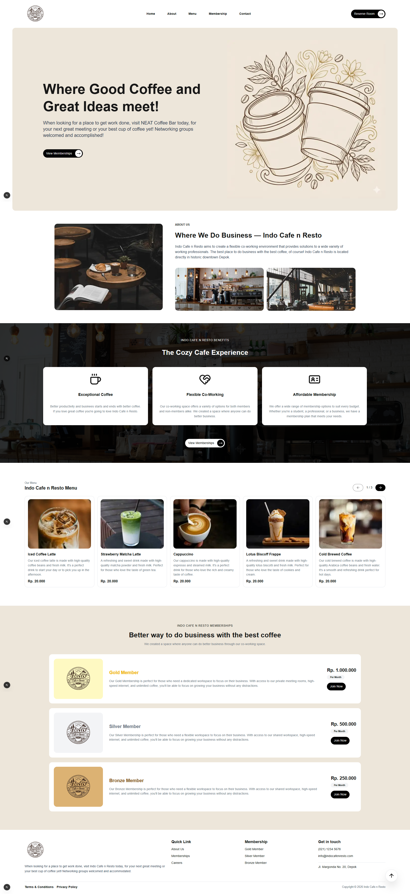

# ☕ Indo Coffee & Co. - Cafe Web App

A modern, responsive, and visually appealing landing page for a coffee shop. This project is part of my web development portfolio supervised by Dibimbing.id Bootcamp, focusing on clean UI/UX and performance.



## 🚀 Features

- ✅ User Login
- ✅ User Registration
- ✅ API Integration using Reqres.in
- ✅ Error handling (invalid credentials)
- ✅ Loading & success state handling

## 🎨 Design Reference

The visual design and layout of this project are inspired by several modern coffee shop website concepts:

- Dribbble – Coffee Shop Landing Page Inspirations:  
  [Coffee Shop Website Design by Sharifulgr for Ovious.Studio](https://dribbble.com/shots/26431247-Coffee-Shop-Website-Design)

> ⚠️ This project is created for **learning and portfolio purposes only**.  
> All designs are **re-implemented from scratch**, not directly copied.

## 🛠️ Tech Stack

- **Frontend:** [Next.js 16](https://nextjs.org/) (Pages Router)
- **Styling:** [Tailwind CSS](https://tailwindcss.com/)
- **API:** [Reqres.in](https://reqres.in)
- **Deploy:** [Vercel](http://vercel.com/)

## 🛠️ Library

- **Cookie:** [cookie](https://www.npmjs.com/package/cookie)
- **Lucide Icons:** [lucide-react](https://lucide.dev/)

## 📦 Installation & Setup

Follow these steps to run the project locally:

1.  **Clone the repository:**

    ```bash
    git clone https://github.com/apifsprd/coffee-shop-web.git
    ```

2.  **Navigate to the project directory:**

    ```bash
    cd coffee-shop-web
    ```

3.  **Install dependencies:**

    ```bash
    npm install
    ```

4.  **Run the development server:**

    ```bash
    npm run dev
    ```

5.  **Open the site:**
    Go to [http://localhost:3000](http://localhost:3000) in your browser.

## 🤝 Contact

Created by **Apif Supriadi** \* Email: [apifsupriadi27@gmail.com]

- LinkedIn: [https://linkedin.com/in/apifsprd]
- Portfolio: [https://apifsprd.web.id]

---

⭐️ If you like this project, feel free to give it a star!
